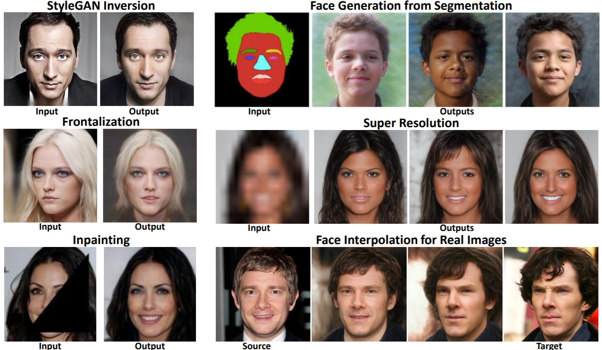
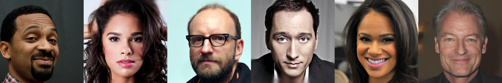
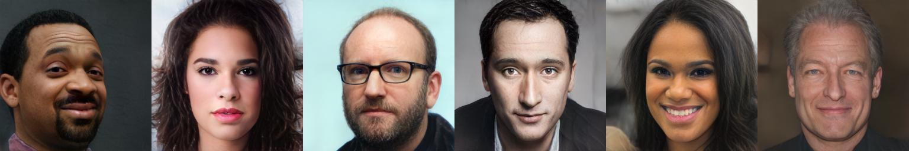
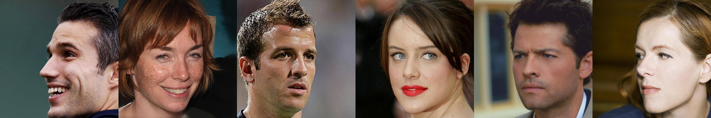
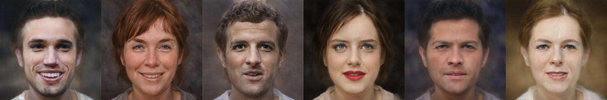
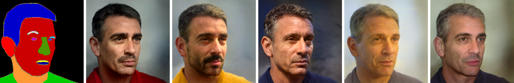
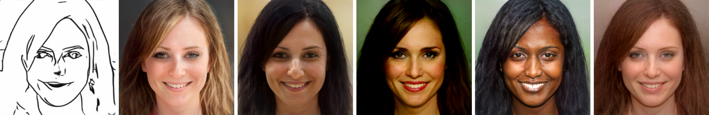
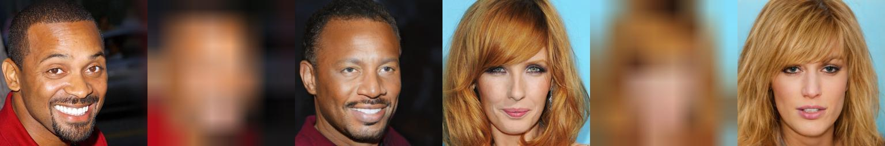
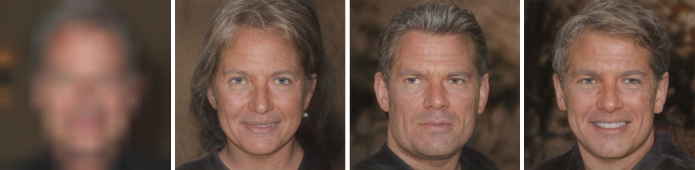
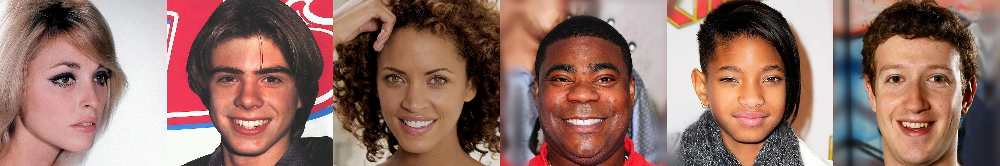

# Encoding in Style: a StyleGAN Encoder for Image-to-Image Translation
<a href="https://arxiv.org/abs/2008.00951"></a>
<a href="https://opensource.org/licenses/MIT"></a>  

<a href="https://www.youtube.com/watch?v=bfvSwhqsTgM"></a>  
<a href="https://replicate.ai/eladrich/pixel2style2pixel"></a>

<a href="http://colab.research.google.com/github/eladrich/pixel2style2pixel/blob/master/notebooks/inference_playground.ipynb"></a>  

> We present a generic image-to-image translation framework, pixel2style2pixel (pSp). 
Our pSp framework is based on a novel encoder network that directly generates a series of style vectors which are fed into a pretrained StyleGAN generator, 
forming the extended W+ latent space. We first show that our encoder can directly embed real images into W+, with no additional optimization.
Next, we propose utilizing our encoder to directly solve image-to-image translation tasks, defining them as encoding problems from some input domain into the 
latent domain. By deviating from the standard "invert first, edit later" methodology used with previous StyleGAN encoders, our approach can handle a variety of 
tasks even when the input image is not represented in the StyleGAN domain. We show that solving translation tasks through StyleGAN significantly simplifies the training process, as no adversary is required, has better support 
>for solving tasks without pixel-to-pixel correspondence, and inherently supports multi-modal synthesis via the resampling of styles. 
Finally, we demonstrate the potential of our framework on a variety of facial image-to-image translation tasks, even when compared to state-of-the-art solutions designed specifically for a single task, and further show that it can be extended beyond the human facial domain. 

<p align="center">

<br>
The proposed pixel2style2pixel framework can be used to solve a wide variety of image-to-image translation tasks. Here we show results of pSp on StyleGAN inversion, multi-modal conditional image synthesis, facial frontalization, inpainting and super-resolution.
</p>

## Description   
Official Implementation of our pSp paper for both training and evaluation. The pSp method extends the StyleGAN model to 
allow solving different image-to-image translation problems using its encoder.

## Table of Contents
  * [Description](#description)
  * [Table of Contents](#table-of-contents)
  * [Recent Updates](#recent-updates)
  * [Applications](#applications)
    + [StyleGAN Encoding](#stylegan-encoding)
    + [Face Frontalization](#face-frontalization)
    + [Conditional Image Synthesis](#conditional-image-synthesis)
    + [Super Resolution](#super-resolution)
  * [Getting Started](#getting-started)
    + [Prerequisites](#prerequisites)
    + [Installation](#installation)
    + [Inference Notebook](#inference-notebook)
    + [Pretrained Models](#pretrained-models)
  * [Training](#training)
    + [Preparing your Data](#preparing-your-data)
    + [Training pSp](#training-psp)
      - [Training the pSp Encoder](#training-the-psp-encoder)
      - [Frontalization](#frontalization)
      - [Sketch to Face](#sketch-to-face)
      - [Segmentation Map to Face](#segmentation-map-to-face)
      - [Super Resolution](#super-resolution-1)
    + [Additional Notes](#additional-notes)
    + [Weights & Biases Integration](#weights--biases-integration)
  * [Testing](#testing)
    + [Inference](#inference)
    + [Multi-Modal Synthesis with Style-Mixing](#multi-modal-synthesis-with-style-mixing)
    + [Computing Metrics](#computing-metrics)
  * [Additional Applications](#additional-applications)
    + [Toonify](#toonify)
  * [Repository structure](#repository-structure)
  * [TODOs](#todos)
  * [Credits](#credits)
  * [Inspired by pSp](#inspired-by-psp)
  * [pSp in the Media](#psp-in-the-media)
  * [Citation](#citation)
  
## Recent Updates
**`2020.10.04`**: Initial code release  
**`2020.10.06`**: Add pSp toonify model (Thanks to the great work from [Doron Adler](https://linktr.ee/Norod78) and [Justin Pinkney](https://www.justinpinkney.com/))!  
**`2021.04.23`**: Added several new features: 
  - Added supported for StyleGANs of different resolutions (e.g., 256, 512, 1024). This can be set using the flag `--output_size`, which is set to 1024 by default. 
  - Added support for the MoCo-Based similarity loss introduced in [encoder4editing (Tov et al. 2021)](https://github.com/omertov/encoder4editing). More details are provided [below](https://github.com/eladrich/pixel2style2pixel#training-psp).  
  
**`2021.07.06`**: Added support for training with Weights & Biases. [See below for details](https://github.com/eladrich/pixel2style2pixel#weights--biases-integration).

## Applications
### StyleGAN Encoding
Here, we use pSp to find the latent code of real images in the latent domain of a pretrained StyleGAN generator. 
<p align="center">


</p>


### Face Frontalization
In this application we want to generate a front-facing face from a given input image. 
<p align="center">


</p>

### Conditional Image Synthesis
Here we wish to generate photo-realistic face images from ambiguous sketch images or segmentation maps. Using style-mixing, we inherently support multi-modal synthesis for a single input.
<p align="center">


</p>

### Super Resolution
Given a low-resolution input image, we generate a corresponding high-resolution image. As this too is an ambiguous task, we can use style-mixing to produce several plausible results.
<p align="center">


</p>


## Getting Started
### Prerequisites
- Linux or macOS
- NVIDIA GPU + CUDA CuDNN (CPU may be possible with some modifications, but is not inherently supported)
- Python 2 or 3

### Installation
- Clone this repo:
``` 
git clone https://github.com/eladrich/pixel2style2pixel.git
cd pixel2style2pixel
```
- Dependencies:  
We recommend running this repository using [Anaconda](https://docs.anaconda.com/anaconda/install/). 
All dependencies for defining the environment are provided in `environment/psp_env.yaml`.

### Inference Notebook
To help visualize the pSp framework on multiple tasks and to help you get started, we provide a Jupyter notebook found in `notebooks/inference_playground.ipynb` that allows one to visualize the various applications of pSp.   
The notebook will download the necessary pretrained models and run inference on the images found in `notebooks/images`.  
For the tasks of conditional image synthesis and super resolution, the notebook also demonstrates pSp's ability to perform multi-modal synthesis using 
style-mixing. 

### Pretrained Models
Please download the pre-trained models from the following links. Each pSp model contains the entire pSp architecture, including the encoder and decoder weights.
| Path | Description
| :--- | :----------
|[StyleGAN Inversion](https://drive.google.com/file/d/1bMTNWkh5LArlaWSc_wa8VKyq2V42T2z0/view?usp=sharing)  | pSp trained with the FFHQ dataset for StyleGAN inversion.
|[Face Frontalization](https://drive.google.com/file/d/1_S4THAzXb-97DbpXmanjHtXRyKxqjARv/view?usp=sharing)  | pSp trained with the FFHQ dataset for face frontalization.
|[Sketch to Image](https://drive.google.com/file/d/1lB7wk7MwtdxL-LL4Z_T76DuCfk00aSXA/view?usp=sharing)  | pSp trained with the CelebA-HQ dataset for image synthesis from sketches.
|[Segmentation to Image](https://drive.google.com/file/d/1VpEKc6E6yG3xhYuZ0cq8D2_1CbT0Dstz/view?usp=sharing) | pSp trained with the CelebAMask-HQ dataset for image synthesis from segmentation maps.
|[Super Resolution](https://drive.google.com/file/d/1ZpmSXBpJ9pFEov6-jjQstAlfYbkebECu/view?usp=sharing)  | pSp trained with the CelebA-HQ dataset for super resolution (up to x32 down-sampling).
|[Toonify](https://drive.google.com/file/d/1YKoiVuFaqdvzDP5CZaqa3k5phL-VDmyz/view)  | pSp trained with the FFHQ dataset for toonification using StyleGAN generator from [Doron Adler](https://linktr.ee/Norod78) and [Justin Pinkney](https://www.justinpinkney.com/).

If you wish to use one of the pretrained models for training or inference, you may do so using the flag `--checkpoint_path`.

In addition, we provide various auxiliary models needed for training your own pSp model from scratch as well as pretrained models needed for computing the ID metrics reported in the paper.
| Path | Description
| :--- | :----------
|[FFHQ StyleGAN](https://drive.google.com/file/d/1EM87UquaoQmk17Q8d5kYIAHqu0dkYqdT/view?usp=sharing) | StyleGAN model pretrained on FFHQ taken from [rosinality](https://github.com/rosinality/stylegan2-pytorch) with 1024x1024 output resolution.
|[IR-SE50 Model](https://drive.google.com/file/d/1KW7bjndL3QG3sxBbZxreGHigcCCpsDgn/view?usp=sharing) | Pretrained IR-SE50 model taken from [TreB1eN](https://github.com/TreB1eN/InsightFace_Pytorch) for use in our ID loss during pSp training.
|[MoCo ResNet-50](https://drive.google.com/file/d/18rLcNGdteX5LwT7sv_F7HWr12HpVEzVe/view?usp=sharing)  | Pretrained ResNet-50 model trained using MOCOv2 for computing MoCo-based similarity loss on non-facial domains. The model is taken from the [official implementation](https://github.com/facebookresearch/moco).
|[CurricularFace Backbone](https://drive.google.com/file/d/1f4IwVa2-Bn9vWLwB-bUwm53U_MlvinAj/view?usp=sharing)  | Pretrained CurricularFace model taken from [HuangYG123](https://github.com/HuangYG123/CurricularFace) for use in ID similarity metric computation.
|[MTCNN](https://drive.google.com/file/d/1tJ7ih-wbCO6zc3JhI_1ZGjmwXKKaPlja/view?usp=sharing)  | Weights for MTCNN model taken from [TreB1eN](https://github.com/TreB1eN/InsightFace_Pytorch) for use in ID similarity metric computation. (Unpack the tar.gz to extract the 3 model weights.)

By default, we assume that all auxiliary models are downloaded and saved to the directory `pretrained_models`. However, you may use your own paths by changing the necessary values in `configs/path_configs.py`. 

## Training
### Preparing your Data
- Currently, we provide support for numerous datasets and experiments (encoding, frontalization, etc.).
    - Refer to `configs/paths_config.py` to define the necessary data paths and model paths for training and evaluation. 
    - Refer to `configs/transforms_config.py` for the transforms defined for each dataset/experiment. 
    - Finally, refer to `configs/data_configs.py` for the source/target data paths for the train and test sets
      as well as the transforms.
- If you wish to experiment with your own dataset, you can simply make the necessary adjustments in 
    1. `data_configs.py` to define your data paths.
    2. `transforms_configs.py` to define your own data transforms.
    
As an example, assume we wish to run encoding using ffhq (`dataset_type=ffhq_encode`). 
We first go to `configs/paths_config.py` and define:
``` 
dataset_paths = {
    'ffhq': '/path/to/ffhq/images256x256'
    'celeba_test': '/path/to/CelebAMask-HQ/test_img',
}
```
The transforms for the experiment are defined in the class `EncodeTransforms` in `configs/transforms_config.py`.   
Finally, in `configs/data_configs.py`, we define:
``` 
DATASETS = {
   'ffhq_encode': {
        'transforms': transforms_config.EncodeTransforms,
        'train_source_root': dataset_paths['ffhq'],
        'train_target_root': dataset_paths['ffhq'],
        'test_source_root': dataset_paths['celeba_test'],
        'test_target_root': dataset_paths['celeba_test'],
    },
}
``` 
When defining our datasets, we will take the values in the above dictionary.


### Training pSp
The main training script can be found in `scripts/train.py`.   
Intermediate training results are saved to `opts.exp_dir`. This includes checkpoints, train outputs, and test outputs.  
Additionally, if you have tensorboard installed, you can visualize tensorboard logs in `opts.exp_dir/logs`.

#### Training the pSp Encoder
```
python scripts/train.py \
--dataset_type=ffhq_encode \
--exp_dir=/path/to/experiment \
--workers=8 \
--batch_size=8 \
--test_batch_size=8 \
--test_workers=8 \
--val_interval=2500 \
--save_interval=5000 \
--encoder_type=GradualStyleEncoder \
--start_from_latent_avg \
--lpips_lambda=0.8 \
--l2_lambda=1 \
--id_lambda=0.1
```

#### Frontalization
```
python scripts/train.py \
--dataset_type=ffhq_frontalize \
--exp_dir=/path/to/experiment \
--workers=8 \
--batch_size=8 \
--test_batch_size=8 \
--test_workers=8 \
--val_interval=2500 \
--save_interval=5000 \
--encoder_type=GradualStyleEncoder \
--start_from_latent_avg \
--lpips_lambda=0.08 \
--l2_lambda=0.001 \
--lpips_lambda_crop=0.8 \
--l2_lambda_crop=0.01 \
--id_lambda=1 \
--w_norm_lambda=0.005
```

#### Sketch to Face
```
python scripts/train.py \
--dataset_type=celebs_sketch_to_face \
--exp_dir=/path/to/experiment \
--workers=8 \
--batch_size=8 \
--test_batch_size=8 \
--test_workers=8 \
--val_interval=2500 \
--save_interval=5000 \
--encoder_type=GradualStyleEncoder \
--start_from_latent_avg \
--lpips_lambda=0.8 \
--l2_lambda=1 \
--id_lambda=0 \
--w_norm_lambda=0.005 \
--label_nc=1 \
--input_nc=1
```

#### Segmentation Map to Face
```
python scripts/train.py \
--dataset_type=celebs_seg_to_face \
--exp_dir=/path/to/experiment \
--workers=8 \
--batch_size=8 \
--test_batch_size=8 \
--test_workers=8 \
--val_interval=2500 \
--save_interval=5000 \
--encoder_type=GradualStyleEncoder \
--start_from_latent_avg \
--lpips_lambda=0.8 \
--l2_lambda=1 \
--id_lambda=0 \
--w_norm_lambda=0.005 \
--label_nc=19 \
--input_nc=19
```
Notice with conditional image synthesis no identity loss is utilized (i.e. `--id_lambda=0`)

#### Super Resolution
``` 
python scripts/train.py \
--dataset_type=celebs_super_resolution \
--exp_dir=/path/to/experiment \
--workers=8 \
--batch_size=8 \
--test_batch_size=8 \
--test_workers=8 \
--val_interval=2500 \
--save_interval=5000 \
--encoder_type=GradualStyleEncoder \
--start_from_latent_avg \
--lpips_lambda=0.8 \
--l2_lambda=1 \
--id_lambda=0.1 \
--w_norm_lambda=0.005 \
--resize_factors=1,2,4,8,16,32
```

### Additional Notes
- See `options/train_options.py` for all training-specific flags. 
- See `options/test_options.py` for all test-specific flags.
- If you wish to resume from a specific checkpoint (e.g. a pretrained pSp model), you may do so using `--checkpoint_path`.
- By default, we assume that the StyleGAN used outputs images at resolution `1024x1024`. If you wish to use a StyleGAN at a smaller resolution, you can do so by using the flag `--output_size` (e.g., `--output_size=256`). 
- If you wish to generate images from segmentation maps, please specify `--label_nc=N`  and `--input_nc=N` where `N` 
is the number of semantic categories. 
- Similarly, for generating images from sketches, please specify `--label_nc=1` and `--input_nc=1`.
- Specifying `--label_nc=0` (the default value), will directly use the RGB colors as input.

** Identity/Similarity Losses **   
In pSp, we introduce a facial identity loss using a pre-trained ArcFace network for facial recognition. When operating on the human facial domain, we 
highly recommend employing this loss objective by using the flag `--id_lambda`.  
In a more recent paper, [encoder4editing](https://github.com/omertov/encoder4editing), the authors generalize this identity loss to other domains by 
using a MoCo-based ResNet to extract features instead of an ArcFace network.
Applying this MoCo-based similarity loss can be done by using the flag `--moco_lambda`. We recommend setting `--moco_lambda=0.5` in your experiments.  
Please note, you <ins>cannot</ins> set both `id_lambda` and `moco_lambda` to be active simultaneously (e.g., to use the MoCo-based loss, you should specify, 
`--moco_lambda=0.5 --id_lambda=0`).

### Weights & Biases Integration
To help track your experiments, we've integrated [Weights & Biases](https://wandb.ai/home) into our training process. 
To enable Weights & Biases (`wandb`), first make an account on the platform's webpage and install `wandb` using 
`pip install wandb`. Then, to train pSp using `wandb`, simply add the flag `--use_wandb`. 

Note that when running for the first time, you will be asked to provide your access key which can be accessed via the
Weights & Biases platform. 

Using Weights & Biases will allow you to visualize the training and testing loss curves as well as 
intermediate training results.


## Testing
### Inference
Having trained your model, you can use `scripts/inference.py` to apply the model on a set of images.   
For example, 
```
python scripts/inference.py \
--exp_dir=/path/to/experiment \
--checkpoint_path=experiment/checkpoints/best_model.pt \
--data_path=/path/to/test_data \
--test_batch_size=4 \
--test_workers=4 \
--couple_outputs
```
Additional notes to consider: 
- During inference, the options used during training are loaded from the saved checkpoint and are then updated using the 
test options passed to the inference script. For example, there is no need to pass `--dataset_type` or `--label_nc` to the 
 inference script, as they are taken from the loaded `opts`.
- When running inference for segmentation-to-image or sketch-to-image, it is highly recommend to do so with a style-mixing,
as is done in the paper. This can simply be done by adding `--latent_mask=8,9,10,11,12,13,14,15,16,17` when calling the 
script.
- When running inference for super-resolution, please provide a single down-sampling value using `--resize_factors`.
- Adding the flag `--couple_outputs` will save an additional image containing the input and output images side-by-side in the sub-directory
`inference_coupled`. Otherwise, only the output image is saved to the sub-directory `inference_results`.
- By default, the images will be saved at resolutiosn of 1024x1024, the original output size of StyleGAN. If you wish to save 
outputs resized to resolutions of 256x256, you can do so by adding the flag `--resize_outputs`.


### Multi-Modal Synthesis with Style-Mixing
Given a trained model for conditional image synthesis or super-resolution, we can easily generate multiple outputs 
for a given input image. This can be done using the script `scripts/style_mixing.py`.    
For example, running the following command will perform style-mixing for a segmentation-to-image experiment:
```
python scripts/style_mixing.py \
--exp_dir=/path/to/experiment \
--checkpoint_path=/path/to/experiment/checkpoints/best_model.pt \
--data_path=/path/to/test_data/ \
--test_batch_size=4 \
--test_workers=4 \
--n_images=25 \
--n_outputs_to_generate=5 \
--latent_mask=8,9,10,11,12,13,14,15,16,17
``` 
Here, we inject `5` randomly drawn vectors and perform style-mixing on the latents `[8,9,10,11,12,13,14,15,16,17]`.  

Additional notes to consider: 
- To perform style-mixing on a subset of images, you may use the flag `--n_images`. The default value of `None` will perform 
style mixing on every image in the given `data_path`. 
- You may also include the argument `--mix_alpha=m` where `m` is a float defining the mixing coefficient between the 
input latent and the randomly drawn latent.
- When performing style-mixing for super-resolution, please provide a single down-sampling value using `--resize_factors`.
- By default, the images will be saved at resolutiosn of 1024x1024, the original output size of StyleGAN. If you wish to save 
outputs resized to resolutions of 256x256, you can do so by adding the flag `--resize_outputs`.


### Computing Metrics
Similarly, given a trained model and generated outputs, we can compute the loss metrics on a given dataset.  
These scripts receive the inference output directory and ground truth directory.
- Calculating the identity loss: 
```
python scripts/calc_id_loss_parallel.py \
--data_path=/path/to/experiment/inference_outputs \
--gt_path=/path/to/test_images \
```
- Calculating LPIPS loss:
```
python scripts/calc_losses_on_images.py \
--mode lpips
--data_path=/path/to/experiment/inference_outputs \
--gt_path=/path/to/test_images \
```
- Calculating L2 loss:
```
python scripts/calc_losses_on_images.py \
--mode l2
--data_path=/path/to/experiment/inference_outputs \
--gt_path=/path/to/test_images \
```

## Additional Applications
To better show the flexibility of our pSp framework we present additional applications below.

As with our main applications, you may download the pretrained models here: 
| Path | Description
| :--- | :----------
|[Toonify](https://drive.google.com/file/d/1YKoiVuFaqdvzDP5CZaqa3k5phL-VDmyz/view)  | pSp trained with the FFHQ dataset for toonification using StyleGAN generator from [Doron Adler](https://linktr.ee/Norod78) and [Justin Pinkney](https://www.justinpinkney.com/).

### Toonify
Using the toonify StyleGAN built by [Doron Adler](https://linktr.ee/Norod78) and [Justin Pinkney](https://www.justinpinkney.com/),
we take a real face image and generate a toonified version of the given image. We train the pSp encoder to directly reconstruct real 
face images inside the toons latent space resulting in a projection of each image to the closest toon. We do so without requiring any labeled pairs
or distillation!
<p align="center">


</p>

This is trained exactly like the StyleGAN inversion task with several changes:   
- Change from FFHQ StyleGAN to toonifed StyleGAN (can be set using `--stylegan_weights`)
    - The toonify generator is taken from [Doron Adler](https://linktr.ee/Norod78) and [Justin Pinkney](https://www.justinpinkney.com/) 
      and converted to Pytorch using [rosinality's](https://github.com/rosinality/stylegan2-pytorch) conversion script.
    - For convenience, the converted generator Pytorch model may be downloaded [here](https://drive.google.com/file/d/1r3XVCt_WYUKFZFxhNH-xO2dTtF6B5szu/view?usp=sharing).
- Increase `id_lambda` from `0.1` to `1`  
- Increase `w_norm_lambda` from `0.005` to `0.025`  

We obtain the best results after around `6000` iterations of training (can be set using `--max_steps`) 


## Repository structure
| Path | Description 
| :--- | :---
| pixel2style2pixel | Repository root folder
| &boxvr;&nbsp; configs | Folder containing configs defining model/data paths and data transforms
| &boxvr;&nbsp; criteria | Folder containing various loss criterias for training
| &boxvr;&nbsp; datasets | Folder with various dataset objects and augmentations
| &boxvr;&nbsp; environment | Folder containing Anaconda environment used in our experiments
| &boxvr; models | Folder containting all the models and training objects
| &boxv;&nbsp; &boxvr;&nbsp; encoders | Folder containing our pSp encoder architecture implementation and ArcFace encoder implementation from [TreB1eN](https://github.com/TreB1eN/InsightFace_Pytorch)
| &boxv;&nbsp; &boxvr;&nbsp; mtcnn | MTCNN implementation from [TreB1eN](https://github.com/TreB1eN/InsightFace_Pytorch)
| &boxv;&nbsp; &boxvr;&nbsp; stylegan2 | StyleGAN2 model from [rosinality](https://github.com/rosinality/stylegan2-pytorch)
| &boxv;&nbsp; &boxur;&nbsp; psp.py | Implementation of our pSp framework
| &boxvr;&nbsp; notebook | Folder with jupyter notebook containing pSp inference playground
| &boxvr;&nbsp; options | Folder with training and test command-line options
| &boxvr;&nbsp; scripts | Folder with running scripts for training and inference
| &boxvr;&nbsp; training | Folder with main training logic and Ranger implementation from [lessw2020](https://github.com/lessw2020/Ranger-Deep-Learning-Optimizer)
| &boxvr;&nbsp; utils | Folder with various utility functions
|  | 

## TODOs
- [ ] Add multi-gpu support

## Credits
**StyleGAN2 implementation:**  
https://github.com/rosinality/stylegan2-pytorch  
Copyright (c) 2019 Kim Seonghyeon  
License (MIT) https://github.com/rosinality/stylegan2-pytorch/blob/master/LICENSE  

**MTCNN, IR-SE50, and ArcFace models and implementations:**  
https://github.com/TreB1eN/InsightFace_Pytorch  
Copyright (c) 2018 TreB1eN  
License (MIT) https://github.com/TreB1eN/InsightFace_Pytorch/blob/master/LICENSE  

**CurricularFace model and implementation:**   
https://github.com/HuangYG123/CurricularFace  
Copyright (c) 2020 HuangYG123  
License (MIT) https://github.com/HuangYG123/CurricularFace/blob/master/LICENSE  

**Ranger optimizer implementation:**  
https://github.com/lessw2020/Ranger-Deep-Learning-Optimizer   
License (Apache License 2.0) https://github.com/lessw2020/Ranger-Deep-Learning-Optimizer/blob/master/LICENSE  

**LPIPS implementation:**  
https://github.com/S-aiueo32/lpips-pytorch  
Copyright (c) 2020, Sou Uchida  
License (BSD 2-Clause) https://github.com/S-aiueo32/lpips-pytorch/blob/master/LICENSE  

**Please Note**: The CUDA files under the [StyleGAN2 ops directory](https://github.com/eladrich/pixel2style2pixel/tree/master/models/stylegan2/op) are made available under the [Nvidia Source Code License-NC](https://nvlabs.github.io/stylegan2/license.html)

## Inspired by pSp
Below are several works inspired by pSp that we found particularly interesting:  

**Reverse Toonification**  
Using our pSp encoder, artist [Nathan Shipley](https://linktr.ee/nathan_shipley) transformed animated figures and paintings into real life. Check out his amazing work on his [twitter page](https://twitter.com/citizenplain?lang=en) and [website](http://www.nathanshipley.com/gan).   

**Deploying pSp with StyleSpace for Editing**  
Awesome work from [Justin Pinkney](https://www.justinpinkney.com/) who deployed our pSp model on Runway and provided support for editing the resulting inversions using the [StyleSpace Analysis paper](https://arxiv.org/abs/2011.12799). Check out his repository [here](https://github.com/justinpinkney/pixel2style2pixel).

**Encoder4Editing (e4e)**   
Building on the work of pSp, Tov et al. design an encoder to enable high quality edits on real images. Check out their [paper](https://arxiv.org/abs/2102.02766) and [code](https://github.com/omertov/encoder4editing).

**Style-based Age Manipulation (SAM)**  
Leveraging pSp and the rich semantics of StyleGAN, SAM learns non-linear latent space paths for modeling the age transformation of real face images. Check out the project page [here](https://yuval-alaluf.github.io/SAM/).

**ReStyle**  
ReStyle builds on recent encoders such as pSp and e4e by introducing an iterative refinment mechanism to gradually improve the inversion of real images. Check out the project page [here](https://yuval-alaluf.github.io/restyle-encoder/).

## pSp in the Media
* bycloud: [AI Generates Cartoon Characters In Real Life Pixel2Style2Pixel](https://www.youtube.com/watch?v=g-N8lfceclI&ab_channel=bycloud)
* Synced: [Pixel2Style2Pixel: Novel Encoder Architecture Boosts Facial Image-To-Image Translation](https://syncedreview.com/2020/08/07/pixel2style2pixel-novel-encoder-architecture-boosts-facial-image-to-image-translation/)
* Cartoon Brew: [An Artist Has Used Machine Learning To Turn Animated Characters Into Creepy Photorealistic Figures](https://www.cartoonbrew.com/tech/an-artist-has-used-machine-learning-to-turn-animated-characters-into-creepy-photorealistic-figures-197975.html)


## Citation
If you use this code for your research, please cite our paper <a href="https://arxiv.org/abs/2008.00951">Encoding in Style: a StyleGAN Encoder for Image-to-Image Translation</a>:

```
@InProceedings{richardson2021encoding,
      author = {Richardson, Elad and Alaluf, Yuval and Patashnik, Or and Nitzan, Yotam and Azar, Yaniv and Shapiro, Stav and Cohen-Or, Daniel},
      title = {Encoding in Style: a StyleGAN Encoder for Image-to-Image Translation},
      booktitle = {IEEE/CVF Conference on Computer Vision and Pattern Recognition (CVPR)},
      month = {June},
      year = {2021}
}
```
